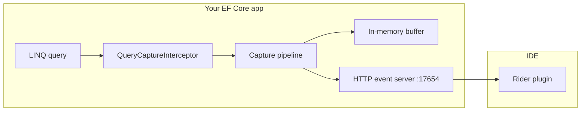

# QueryDuck

**QueryDuck** is an EF Core 10 debugging toolkit for Oracle, PostgreSQL, SQL Server, MySQL/MariaDB, and SQLite. It captures every SQL command your app executes, analyzes LINQ expression trees, flags provider-specific pitfalls, detects N+1 and slow queries, and recommends concrete fixes — all visible in **JetBrains Rider** via a local HTTP event server.


---

## Table of contents

- [Quick start](#quick-start)
- [Installation](#installation)
- [How it works](#how-it-works)
- [Configuration](#configuration)
- [IDE integration](#ide-integration)
  - [Rider plugin](#rider-plugin)
- [Diagnostic rules (QD001–QD024)](#diagnostic-rules-qd001qd024)
- [Session insights](#session-insights)
- [Slow query improvement engine](#slow-query-improvement-engine)
- [Advanced relational insights (opt-in)](#advanced-relational-insights-opt-in)
- [Heuristic memory](#heuristic-memory)
- [OpenTelemetry exporter](#opentelemetry-exporter)
- [Entity Framework Extensions bridge](#entity-framework-extensions-bridge)
- [Serilog exporter](#serilog-exporter)
- [Test & CI guardrails](#test--ci-guardrails)
- [HTTP API](#http-api)
- [Manual capture & debugger support](#manual-capture--debugger-support)
- [Build, test, and CI](#build-test-and-ci)
- [License](#license)

---

## Quick start

**1. Install the NuGet package**

```bash
dotnet add package QueryDuck.Core
```

**2. Enable debugging in your `DbContext`**

```csharp
using QueryDuck.Core;
using QueryDuck.Core.Adapters;

var options = new DbContextOptionsBuilder<MyDbContext>()
    .UseNpgsql(connectionString)
    .UseQueryDuckDebugging();   // starts local server + auto-capture
    // .UseQueryDuckDebugging(DatabaseAdapterRegistry.CreateWithAllProviders()); // for EXPLAIN / slow-query plans

await using var context = new MyDbContext(options);
await context.Orders.Where(o => o.Status == "open").ToListAsync();
```

**3. Open the tool window**

| IDE | Menu |
|-----|------|
| **Rider** | View → Tool Windows → **QueryDuck** |

The plugin connects to `http://127.0.0.1:17654` automatically. You should see captured queries appear within a few seconds.

**4. Try the sample app**

```bash
dotnet run --project samples/QueryDuck.Sample
```

Leave it running, then open the QueryDuck tool window in your IDE.

---

## Installation

### NuGet packages (v1.5.0)

| Package | When to install |
|---------|-----------------|
| **`QueryDuck.Core`** | Always — capture, diagnostics, event server, all provider adapters, bundled Roslyn analyzers |
| **`QueryDuck.Serilog`** | Optional — export SQL failures and slow queries to Serilog |
| **`QueryDuck.OpenTelemetry`** | Optional — export capture events as OpenTelemetry `Activity` spans |
| **`QueryDuck.EntityFrameworkExtensions`** | Optional — capture Z.EntityFramework.Extensions bulk/batch SQL |

Provider adapters (Oracle, PostgreSQL, SQL Server, MySQL, SQLite) are built into **QueryDuck.Core** — use `DatabaseAdapterRegistry.CreateWithAllProviders()` from `QueryDuck.Core.Adapters`.

```bash
dotnet add package QueryDuck.Core
# optional:
dotnet add package QueryDuck.Serilog
dotnet add package QueryDuck.OpenTelemetry
dotnet add package QueryDuck.EntityFrameworkExtensions
```

### IDE plugins

| IDE | Install |
|-----|---------|
| **Rider** | Build from `rider-plugin/` (`gradle buildPlugin`) or download the `.zip` from a [GitHub Release](https://github.com/FilipMrhal/QueryDuck/releases) |

---

## How it works



1. **`UseQueryDuckCapture()`** registers EF Core interceptors on your `DbContext`.
2. Every executed command is recorded with SQL, parameters, duration, expression tree, and diagnostics.
3. Slow queries trigger optional EXPLAIN capture and an improvement analysis engine.
4. Events are stored in a ring buffer and exposed via a **local HTTP server** (default `http://127.0.0.1:17654`).
5. The **Rider** plugin polls that server and renders a rich tool window.

`UseQueryDuckDebugging()` is shorthand that enables auto-capture, the event server, and expression-tree attachment on every query.

---

## Configuration

### `UseQueryDuckDebugging()` vs `UseQueryDuckCapture()` vs `UseQueryDuckProduction()`

| Method | Event server | Serilog exporter | Typical use |
|--------|--------------|------------------|-------------|
| `UseQueryDuckDebugging()` | On | Off | Local development with Rider |
| `UseQueryDuckProduction(logger)` | **Off** | **On** | Production: Serilog only, no HTTP server |
| `UseQueryDuckCapture(o => …)` | Configurable | Configurable | Custom setup |

`UseQueryDuckProduction` (in the `QueryDuck.Serilog` package) sets `StartLocalEventServer = false`
and registers the Serilog exporter. Both are just defaults — the `configure` callback runs last, so
any option (including re-enabling the server) can be overridden, e.g. driven by `appsettings.json`:

```csharp
using QueryDuck.Serilog;

options.UseQueryDuckProduction(
    Log.Logger,
    configureSerilog: serilog => serilog.LogSlowQueries = true,
    configure: o =>
    {
        // read from your configuration system
        o.StartLocalEventServer = config.GetValue<bool>("QueryDuck:StartLocalEventServer");
        o.SlowQueryThresholdMs = config.GetValue<int>("QueryDuck:SlowQueryThresholdMs");
    });
```

### Common options

```csharp
options.UseQueryDuckDebugging(o =>
{
    // Session heuristics
    o.DetectNPlusOne = true;
    o.NPlusOneThreshold = 5;
    o.SlowQueryThresholdMs = 500;

    // Execution plans (requires adapter registry)
    o.CapturePlansForSlowQueries = true;
    o.AnalyzeSlowQueries = true;

    // Buffer
    o.BufferCapacity = 200;
    o.ServerPrefix = "http://127.0.0.1:17654/";

    // Local heuristic memory (re-ranks slow-query recommendations from IDE feedback)
    o.EnableHeuristicMemory = true;
    o.HeuristicMemoryStorePath = null; // defaults to ~/.queryduck/memory.db
}, DatabaseAdapterRegistry.CreateWithAllProviders());
```

### All `QueryCaptureOptions`

| Option | Default | Description |
|--------|---------|-------------|
| `BufferCapacity` | `200` | Max events kept in memory |
| `StartLocalEventServer` | `true` | Start HTTP server for IDE plugins |
| `ServerPrefix` | `http://127.0.0.1:17654/` | Event server base URL |
| `AutoCaptureAllQueries` | `true` | Attach expression trees without `WithQueryDuckScope()` |
| `DetectNPlusOne` | `true` | Session N+1 warnings |
| `NPlusOneThreshold` | `5` | Repeated SQL shape count to flag N+1 |
| `SlowQueryThresholdMs` | `500` | Slow query threshold (ms) |
| `AnalyzeSlowQueries` | `true` | Attach improvement analysis to slow events |
| `CapturePlansForSlowQueries` | `true` | EXPLAIN slow queries automatically |
| `CaptureExecutionPlans` | `false` | EXPLAIN every query (expensive) |
| `EnableHistoricalStatsInsights` | `false` | Historical workload stats from the active provider (opt-in) |
| `EnablePgStatStatementsInsights` | *(alias)* | Same as `EnableHistoricalStatsInsights` (PostgreSQL backward compat) |
| `EnableStatisticsBasedIndexRecommendations` | `false` | PostgreSQL `pg_stats` index hints (opt-in) |
| `EmitMermaidPlanGraphs` | `false` | Mermaid flowcharts in plan diffs (opt-in) |
| `EnableHeuristicMemory` | `true` | Learn from slow-query captures and IDE feedback to re-rank recommendations |
| `HeuristicMemoryStorePath` | `~/.queryduck/memory.db` | SQLite store path for local heuristic memory |
| `HeuristicMemoryMaxEntries` | `5000` | Max feedback rows before oldest entries are pruned |
| `EnableSampling` | `false` | Sample successful fast queries (failures/slow always captured) |
| `SamplingRate` | `0.05` | Fraction of fast queries to capture when sampling is on |
| `CaptureSourceLocations` | `true` | Attach user-code file/line from stack trace for Rider jump-to-source |
| `PublishEvents` | `false` | POST events to remote endpoint |
| `EventPublishers` | `[]` | Custom exporters (e.g. Serilog) |

### Provider adapters

Register adapters when you need EXPLAIN plans, schema audit, or PostgreSQL insights:

```csharp
using QueryDuck.Core.Adapters;

var adapters = DatabaseAdapterRegistry.CreateWithAllProviders();
```

---

## IDE integration

### Rider plugin

**Open:** View → Tool Windows → **QueryDuck** (bottom dock)

**Toolbar:** Refresh, Clear, **Open source**, Auto-refresh, Follow latest, server URL, provider/tag filters, connection status.

**Left panel — Captured queries:** table with Time, Provider, Tag, Warn, Ms, SQL preview. Select two events in sequence and use **Compare 2 selected** on the Session tab.

**Right panel — Detail tabs:**

| Tab | Content |
|-----|---------|
| **SQL** | Syntax-highlighted SQL |
| **Expression Tree** | Interactive LINQ tree + Copy button |
| **C# Expression** | Rendered C# source |
| **Diagnostics** | QD001–QD024 warnings with fix hints |
| **Parameters** | Parameter name/value table |
| **Plan** | EXPLAIN output |
| **Improvements** | Recommendations, migration snippets, plan graphs, dismiss/copy feedback |
| **Schema** | Cached schema audit (nullability, types, missing columns, FK/index hints) |
| **Session** | Baseline, compare, export/import JSON sessions |
| **Hotspots** | Repeated SQL shapes ranked by count and total duration |
| **Timeline** | Query + SaveChanges timeline for the session |
| **Traces** | Events grouped by `traceId`, `correlationId`, or `requestPath` |
| **Diff** | Side-by-side diff of two selected events (SQL, parameters, diagnostics) |
| **Cache** | Statement-cache / plan-cache diagnostics from the active provider |
| **Memory** | Heuristic memory stats, workload ledger, clear learned data |


Session warnings (N+1, slow queries) appear in an amber banner above the split pane.

**Build the plugin locally:**

```bash
cd rider-plugin
gradle buildPlugin
# Output: rider-plugin/build/distributions/queryduck-rider-plugin-1.5.0.zip
```

Install via Rider → Settings → Plugins → ⚙ → Install Plugin from Disk.

---

## Diagnostic rules (QD001–QD024)

QueryDuck analyzes LINQ expression trees before SQL runs. Warnings appear in the **Diagnostics** tab and in captured events.

| Rule | Scope | Detects |
|------|-------|---------|
| **QD001** | Oracle | Empty string comparisons (`''` treated as NULL) |
| **QD002** | All | Inlined constants in predicates |
| **QD003** | All | Non-nullable aggregate selectors |
| **QD004** | All | Nullable captured variable comparisons |
| **QD005** | SQL Server, MySQL | Case-insensitive string comparisons |
| **QD006** | All | Large captured `Contains` / IN-list filters |
| **QD007** | All | `DateTime.Now` / `UtcNow` evaluated by the database |
| **QD008** | All | Boolean literal comparisons (`== true/false`) |
| **QD009** | All | `First`/`Single`/`Last` without `OrderBy` |
| **QD010** | All | Multiple `Include`/`ThenInclude` without `AsSplitQuery` (cartesian risk) |
| **QD011** | All | `Take`/`Skip` without `OrderBy` |
| **QD012** | All | Non-translatable patterns (`AsEnumerable`, `Compile`, local delegates) |
| **QD013** | All | `string.Contains`/`StartsWith`/`EndsWith` (index-unfriendly) |
| **QD014** | All | Repeated `SaveChanges` in one session (session warning via interceptor) |
| **QD015** | All | Read-only projection queries missing `AsNoTracking` |
| **QD016** | All | `FromSqlRaw`/`ExecuteSqlRaw` with string literal SQL (no parameters) |
| **QD017** | All | `ExecuteUpdate`/`ExecuteDelete` without a `Where` filter |
| **QD018** | All | Dynamic `OrderBy` keys (runtime-driven sort) |
| **QD019** | All | `Count`/`Any`/`LongCount` without a `Where` filter (table scan risk) |
| **QD020** | All | Multiple `OrderBy` calls (use `ThenBy` instead) |
| **QD021** | All | `ToLower`/`ToUpper` in predicates (index-unfriendly) |
| **QD022** | All | `Distinct` on full entities without `Select` projection |
| **QD023** | All | `GroupBy` without aggregate or projection |
| **QD024** | All | `IgnoreQueryFilters` (bypasses global/tenant filters) |

Roslyn compile-time analyzers ship for **QD001**, **QD003**, and **QD005** inside the **`QueryDuck.Core`** package (`analyzers/dotnet/cs`). Rules **QD002** and **QD004–QD024** run at capture time via expression-tree analysis.

---

## Session insights

While your app runs, QueryDuck aggregates session-level intelligence:

- **N+1 detection** — same SQL shape executed ≥ `NPlusOneThreshold` times (default 5)
- **Slow queries** — commands slower than `SlowQueryThresholdMs` (default 500 ms)
- **Hotspots** — top repeated SQL shapes by execution count and total duration (`GET /queryduck/session/hotspots`)
- **Timeline** — chronological query + `SaveChanges` events (`GET /queryduck/session/timeline`)
- **Trace grouping** — events grouped by OpenTelemetry `traceId`, `correlationId`, or HTTP `requestPath` (`GET /queryduck/session/traces`)
- **Export/import** — persist and reload sessions as JSON for before/after comparisons across runs
- **Baseline compare** — snapshot metrics and diff against a captured baseline

Warnings are returned on `GET /queryduck/health` and shown in the IDE tool window banner.

```csharp
// Export current session programmatically
var json = QueryDuckSessionExportService.ExportJson(options);
QueryDuckSessionExportService.ImportJson(json); // reload in another process
```

---

## Slow query improvement engine

When duration ≥ `SlowQueryThresholdMs`, QueryDuck analyzes SQL and (optionally) EXPLAIN output and attaches `improvementAnalysis` to the event.

| Category | Example recommendation |
|----------|------------------------|
| **IndexCreation** | Full table scan → `CREATE INDEX …` DDL |
| **ManualRewrite** | `SELECT *`, leading `%LIKE`, OR predicates → rewritten SQL + plan diff |
| **UseCte** | Correlated subqueries → `WITH filtered_… AS (…)` template |
| **SchemaSeparation** | Wide joins / `SELECT *` → split hot vs cold columns |
| **ApplicationChange** | Unbounded result sets → add paging / `LIMIT` |

When a rewrite is safe to EXPLAIN, QueryDuck runs it against your live connection (best-effort) and builds a **plan comparison** showing original vs improved steps and estimated cost reduction.

Index recommendations include an optional **EF migration snippet** (`suggestedMigrationSql`) you can paste into a new migration class.

Open the **Improvements** tab in Rider to see recommendations, suggested SQL/DDL, migration snippets, side-by-side plan graphs, and text diffs.

---

## Advanced relational insights (opt-in)

All **off by default**:

```csharp
options.UseQueryDuckDebugging(o =>
{
    o.EnableHistoricalStatsInsights = true; // or EnablePgStatStatementsInsights (alias)
    o.EnableStatisticsBasedIndexRecommendations = true;
    o.EmitMermaidPlanGraphs = true;
}, DatabaseAdapterRegistry.CreateWithAllProviders());
```

| Option | Provider source | Adds |
|--------|-----------------|------|
| `EnableHistoricalStatsInsights` | PostgreSQL `pg_stat_statements` | Historical calls, mean/total time, rows, cache hit ratio |
| | SQL Server `sys.dm_exec_query_stats` + `dm_exec_sql_text` | Same metrics from DMVs |
| | Oracle `V$SQL` | Execution counts and elapsed time |
| | MySQL `performance_schema.events_statements_summary_by_digest` | Digest-level workload stats |
| | SQLite | *(pg_stat_statements unavailable — use heuristic memory workload ledger instead)* |
| `EnableStatisticsBasedIndexRecommendations` | PostgreSQL `pg_stats` | Index column order + partial-index hints |
| `EmitMermaidPlanGraphs` | Plan diff / EXPLAIN | Mermaid flowcharts for side-by-side rendering |

Captured events include both `historicalStats` (provider-agnostic DTO) and `pgStatStatements` (PostgreSQL backward-compat DTO) when matched.

### Richer schema audit

Schema audit now reports, in addition to nullability and type mismatches:

- **Missing columns** — model properties with no matching database column
- **Foreign key hints** — FK columns that may need indexes for join performance
- **Missing index suggestions** — derived from EF model foreign keys

Refresh via `GET /queryduck/schema/audit` or the Rider **Schema** tab.

**PostgreSQL prerequisite:**

```sql
CREATE EXTENSION IF NOT EXISTS pg_stat_statements;
```

---

## Entity Framework Extensions bridge

Standard EF Core LINQ is captured via `DbCommandInterceptor`. **[Z.EntityFramework.Extensions](https://entityframework-extensions.net/)** bulk/batch operations bypass that pipeline.

```bash
dotnet add package QueryDuck.EntityFrameworkExtensions
dotnet add package Z.EntityFramework.Extensions.EFCore   # licensed — required in your app
```

```csharp
using QueryDuck.EntityFrameworkExtensions;

options.UseQueryDuckDebugging(o => { … }, adapters)
       .UseQueryDuckEntityFrameworkExtensions(adapters);

// Or once at startup:
QueryDuckEntityFrameworkExtensionsIntegration.Enable(adapters);
```

Bulk events include `source: EntityFrameworkExtensions`, `bulkOperation` (e.g. `BulkInsert`), SQL from operation logs, and duration when available.

**Limitations:** no LINQ expression tree for bulk ops; `UpdateFromQuery` / `DeleteFromQuery` may show zero duration.

---

## Serilog exporter

Export SQL **failures** and **slow queries** to Serilog with structured `QueryDuck` properties. Sensitive data and PII are **excluded by default**.

```bash
dotnet add package QueryDuck.Serilog
```

The easiest production setup is the `UseQueryDuckProduction` preset — Serilog exporter on, HTTP event server off:

```csharp
using QueryDuck.Serilog;
using Serilog;

Log.Logger = new LoggerConfiguration().WriteTo.Console().CreateLogger();

options.UseQueryDuckProduction(Log.Logger, serilog =>
{
    serilog.LogSlowQueries = true;
    serilog.LogSqlFailures = true;
    serilog.LogSuccessfulQueries = false;
});
```

For full control, use `UseQueryDuckCapture` and wire the exporter yourself:

```csharp
options.UseQueryDuckCapture(o =>
{
    o.StartLocalEventServer = false; // typical in production
    o.SlowQueryThresholdMs = 500;
    o.AddSerilogExporter(Log.Logger, serilog =>
    {
        serilog.LogSlowQueries = true;
        serilog.LogSqlFailures = true;
        serilog.LogSuccessfulQueries = false;

        serilog.SensitiveData.IncludeSensitiveData = false;
        serilog.SensitiveData.IncludeParameterValues = false;
        serilog.SensitiveData.IncludePii = false;
    });
}, adapters);
```

| Serilog option | Default | Purpose |
|----------------|---------|---------|
| `LogSqlFailures` | `true` | `Error` logs on EF command failure |
| `LogSlowQueries` | `true` | `Warning` logs when duration ≥ threshold |
| `LogSuccessfulQueries` | `false` | Skip fast successful queries |
| `SensitiveData.IncludeSensitiveData` | `false` | Master switch for values, plans, rewrite SQL |
| `SensitiveData.IncludePii` | `false` | Opt-in for PII-like parameter names |
| `SensitiveData.DefaultMode` / `PiiMode` | `Redact` | `Omit`, `Redact`, `Hash`, or `Include` |

SQL failures include `ErrorMessage` and `ExceptionType`. Event schema **v8** adds `sourceLocation` (file/line for jump-to-source) and `suggestedMigrationSql` on index recommendations.

### Production sampling preset

Capture a fraction of fast successful queries while always logging failures and slow queries:

```csharp
options.UseQueryDuckProductionSampling(
    Log.Logger,
    samplingRate: 0.05,
    configure: o => o.SlowQueryThresholdMs = 500);
```

Or configure manually:

```csharp
options.UseQueryDuckCapture(o =>
{
    o.EnableSampling = true;
    o.SamplingRate = 0.05; // 5% of fast successful queries
});
```

---

## OpenTelemetry exporter

Export SQL failures and slow queries as OpenTelemetry `Activity` spans:

```bash
dotnet add package QueryDuck.OpenTelemetry
```

```csharp
using QueryDuck.OpenTelemetry;

options.UseQueryDuckCapture(o =>
{
    o.AddOpenTelemetryExporter(otel =>
    {
        otel.IncludeSqlText = false;
        otel.RecordSlowQueriesOnly = true;
        otel.IncludeDiagnostics = true;
    });
}, adapters);
```

Span tags include `queryduck.event_id`, `queryduck.provider`, `queryduck.duration_ms`, and trace correlation fields when present.

---

## Heuristic memory

QueryDuck can learn from your local debugging sessions without ML.NET or cloud services. When enabled, it:

1. Fingerprints slow-query SQL shapes (normalized SQL + provider).
2. Records IDE feedback when you select or copy a recommendation in Rider.
3. Re-ranks future recommendations for similar queries on your machine.

Data stays local in a SQLite file (default: `~/.queryduck/memory.db`). Disable with `EnableHeuristicMemory = false`, or point `HeuristicMemoryStorePath` at a custom path.

The Rider plugin posts feedback when you pick, copy, or dismiss a suggestion. Historical workload insights stay pinned at the top when re-ranking.

**SQLite workload ledger:** when `pg_stat_statements` is unavailable, slow-query shapes are recorded locally in `shape_outcomes`. Query via `GET /queryduck/memory/workload?provider=Sqlite`.

```csharp
options.UseQueryDuckDebugging(o =>
{
    o.EnableHeuristicMemory = true;
    o.HeuristicMemoryMaxEntries = 5000;
    o.CaptureSourceLocations = true;
});
```

---

## Test & CI guardrails

The `QueryDuck.Testing` project (repo-internal) provides assertions for integration tests:

```csharp
using QueryDuck.Testing.Assertions;

await RunEndpointAsync();

QueryDuckCaptureAssert.ShouldExecuteAtMost(3);
QueryDuckCaptureAssert.ShouldNotTriggerNPlusOne();
QueryDuckCaptureAssert.ShouldNotBeSlow(thresholdMs: 500);
QueryDuckCaptureAssert.ShouldContainRule("QD010");

query.Should().ShouldHaveNoWarnings();
query.Should().ShouldContainRule("QD003");
```

| Assertion | Purpose |
|-----------|---------|
| `ShouldExecuteAtMost(n)` | Cap total captured queries per test |
| `ShouldNotTriggerNPlusOne()` | Fail if repeated SQL shapes exceed threshold |
| `ShouldNotBeSlow(ms)` | Fail if any captured query exceeds duration |
| `ShouldContainRule` / `ShouldNotContainRule` | Assert diagnostics on captured events |
| `ShouldHaveSqlContaining(fragment)` | Assert SQL text in capture buffer |
| `QueryDuckSessionAssert.ShouldHaveHotspot` | Assert repeated shape in session hotspots |

Use `TagWith("Test:ScenarioName")` on queries to filter captures in Rider and group baselines per scenario.

---

## HTTP API

Default base URL: **`http://127.0.0.1:17654`**

| Endpoint | Method | Description |
|----------|--------|-------------|
| `/queryduck/events` | GET | JSON array of captured events |
| `/queryduck/events/latest` | GET | NDJSON stream |
| `/queryduck/health` | GET | Status, event count, session warnings |
| `/queryduck/session/warnings` | GET | N+1 and slow-query warnings only |
| `/queryduck/schema/audit` | GET | Cached schema audit snapshot (throttled refresh from capture pipeline) |
| `/queryduck/session/baseline` | POST | Capture current session metrics as baseline |
| `/queryduck/session/compare` | GET | Compare current session to baseline (deltas, new warnings) |
| `/queryduck/session/hotspots` | GET | Top repeated SQL shapes by count and duration |
| `/queryduck/session/export` | GET | Export session as JSON (events + warnings + snapshot) |
| `/queryduck/session/import` | POST | Import a previously exported session JSON |
| `/queryduck/session/timeline` | GET | Query + SaveChanges timeline |
| `/queryduck/session/traces` | GET | Events grouped by trace/correlation/request path |
| `/queryduck/events/diff` | POST | Diff two events by `leftEventId` / `rightEventId` |
| `/queryduck/diagnostics/statement-cache` | GET | Statement-cache / plan-cache diagnostics for the active provider |
| `/queryduck/memory/feedback` | POST | Record recommendation feedback (`Viewed`, `Selected`, `Copied`, `Dismissed`) |
| `/queryduck/memory/stats` | GET | Local heuristic memory statistics |
| `/queryduck/memory/workload` | GET | Local workload ledger (`?provider=Sqlite`) |
| `/queryduck/memory/clear` | POST | Clear learned feedback |
| `/queryduck/events/clear` | POST | Clear the in-memory buffer |
| `/queryduck/events` | POST | Append a single event (testing) |

Event schema version: **8** (adds `sourceLocation`, `suggestedMigrationSql`; retains v7 trace correlation and historical stats fields).

---

## Manual capture & debugger support

### Auto-capture (default with `UseQueryDuckDebugging`)

Every LINQ query automatically captures its expression tree — no extra code needed.

### Manual scope

When `AutoCaptureAllQueries = false`:

```csharp
await context.Customers
    .Where(c => c.Code == "")
    .WithQueryDuckScope(context)
    .ToListAsync();
```

### Debugger watch window

Inspect a query in the debugger without executing it:

```csharp
var query = context.Customers.Where(c => c.Code == "");
var debug = query.Debug(context);   // add to Watch window

// debug.Sql, debug.ExpressionTree, debug.ExpressionCSharp, debug.Warnings
```

### Jump to source

When `CaptureSourceLocations = true` (default), captured events include `sourceLocation` with the first user-code stack frame (file path + line). In Rider, click **Open source** in the toolbar to navigate to the calling code.

### Programmatic access

```csharp
using QueryDuck.Core.Capture;

var events = QueryDuckCapture.LastCommands;
QueryDuckCapture.Clear();
QueryDuckCapture.RecordFromQuery(query, context);
```

---

## Build, test, and CI

### Prerequisites

- .NET SDK **10.0** (see [global.json](global.json))
- JDK **21** (Rider plugin build)

### Commands

```bash
dotnet build QueryDuck.slnx --configuration Release
dotnet test QueryDuck.slnx --settings coverlet.runsettings
./build/pack.sh          # produces 3 NuGet packages in artifacts/nuget/
```

### CI artifacts (GitHub Actions)

| Artifact | Contents |
|----------|----------|
| `nuget-packages` | `QueryDuck.Core`, `QueryDuck.Serilog`, `QueryDuck.EntityFrameworkExtensions`, `QueryDuck.OpenTelemetry` + symbol packages |
| `queryduck-rider-plugin` | Rider plugin `.zip` |
| `coverage` | Cobertura coverage + test results |

Tag a release as `v1.5.0` to create a GitHub Release with all artifacts. Set the `NUGET_API_KEY` secret to publish to NuGet.org.

See [docs/CODE_QUALITY.md](docs/CODE_QUALITY.md) for coverage gates (85% line coverage).

---

## License

MIT — see [LICENSE](LICENSE).
