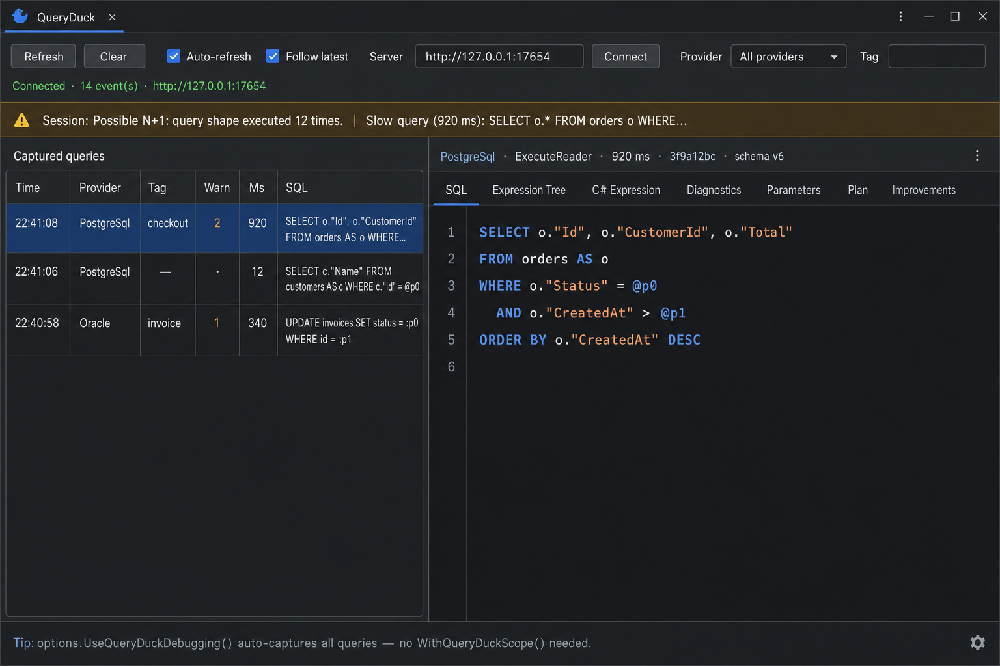
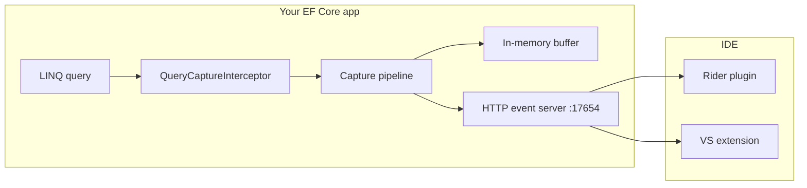
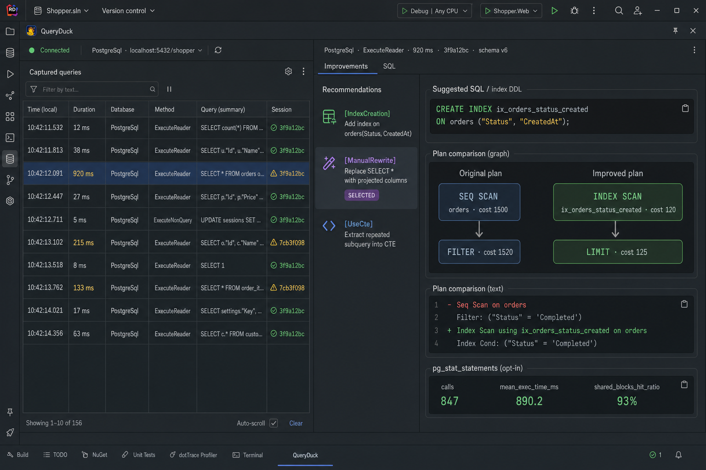

# QueryDuck

**QueryDuck** is an EF Core 10 debugging toolkit for Oracle, PostgreSQL, SQL Server, and MySQL/MariaDB. It captures every SQL command your app executes, analyzes LINQ expression trees, flags provider-specific pitfalls, detects N+1 and slow queries, and recommends concrete fixes — all visible in **JetBrains Rider** or **Visual Studio 2022** via a local HTTP event server.



---

## Table of contents

- [Quick start](#quick-start)
- [Installation](#installation)
- [How it works](#how-it-works)
- [Configuration](#configuration)
- [IDE integration](#ide-integration)
  - [Rider plugin](#rider-plugin)
  - [Visual Studio extension](#visual-studio-extension)
- [Diagnostic rules (QD001–QD009)](#diagnostic-rules-qd001qd009)
- [Session insights](#session-insights)
- [Slow query improvement engine](#slow-query-improvement-engine)
- [Advanced PostgreSQL insights (opt-in)](#advanced-postgresql-insights-opt-in)
- [Entity Framework Extensions bridge](#entity-framework-extensions-bridge)
- [Serilog exporter](#serilog-exporter)
- [HTTP API](#http-api)
- [Manual capture & debugger support](#manual-capture--debugger-support)
- [Build, test, and CI](#build-test-and-ci)
- [License](#license)

---

## Quick start

**1. Install the NuGet package**

```bash
dotnet add package QueryDuck.Core
```

**2. Enable debugging in your `DbContext`**

```csharp
using QueryDuck.Core;
using QueryDuck.Core.Adapters;

var options = new DbContextOptionsBuilder<MyDbContext>()
    .UseNpgsql(connectionString)
    .UseQueryDuckDebugging();   // starts local server + auto-capture
    // .UseQueryDuckDebugging(DatabaseAdapterRegistry.CreateWithAllProviders()); // for EXPLAIN / slow-query plans

await using var context = new MyDbContext(options);
await context.Orders.Where(o => o.Status == "open").ToListAsync();
```

**3. Open the tool window**

| IDE | Menu |
|-----|------|
| **Rider** | View → Tool Windows → **QueryDuck** |
| **Visual Studio 2022** | View → Other Windows → **QueryDuck** |

The plugin connects to `http://127.0.0.1:17654` automatically. You should see captured queries appear within a few seconds.

**4. Try the sample app**

```bash
dotnet run --project samples/QueryDuck.Sample
```

Leave it running, then open the QueryDuck tool window in your IDE.

---

## Installation

### NuGet packages (v1.4.0)

| Package | When to install |
|---------|-----------------|
| **`QueryDuck.Core`** | Always — capture, diagnostics, event server, all provider adapters, bundled Roslyn analyzers |
| **`QueryDuck.Serilog`** | Optional — export SQL failures and slow queries to Serilog |
| **`QueryDuck.EntityFrameworkExtensions`** | Optional — capture Z.EntityFramework.Extensions bulk/batch SQL |

Most apps only need **`QueryDuck.Core`**. Provider adapters (Oracle, PostgreSQL, SQL Server, MySQL) are built in and use pure ADO.NET — no extra provider packages required.

```bash
dotnet add package QueryDuck.Core
# optional:
dotnet add package QueryDuck.Serilog
dotnet add package QueryDuck.EntityFrameworkExtensions
```

### IDE plugins

| IDE | Install |
|-----|---------|
| **Rider** | Build from `rider-plugin/` (`gradle buildPlugin`) or download the `.zip` from a [GitHub Release](https://github.com/FilipMrhal/QueryDuck/releases) |
| **Visual Studio 2022** | Build the VSIX on Windows — see [vs-extension/README.md](vs-extension/README.md) |

---

## How it works



1. **`UseQueryDuckCapture()`** registers EF Core interceptors on your `DbContext`.
2. Every executed command is recorded with SQL, parameters, duration, expression tree, and diagnostics.
3. Slow queries trigger optional EXPLAIN capture and an improvement analysis engine.
4. Events are stored in a ring buffer and exposed via a **local HTTP server** (default `http://127.0.0.1:17654`).
5. The **Rider** or **VS** plugin polls that server and renders a rich tool window.

`UseQueryDuckDebugging()` is shorthand that enables auto-capture, the event server, and expression-tree attachment on every query.

---

## Configuration

### `UseQueryDuckDebugging()` vs `UseQueryDuckCapture()` vs `UseQueryDuckProduction()`

| Method | Event server | Serilog exporter | Typical use |
|--------|--------------|------------------|-------------|
| `UseQueryDuckDebugging()` | On | Off | Local development with Rider/VS |
| `UseQueryDuckProduction(logger)` | **Off** | **On** | Production: Serilog only, no HTTP server |
| `UseQueryDuckCapture(o => …)` | Configurable | Configurable | Custom setup |

`UseQueryDuckProduction` (in the `QueryDuck.Serilog` package) sets `StartLocalEventServer = false`
and registers the Serilog exporter. Both are just defaults — the `configure` callback runs last, so
any option (including re-enabling the server) can be overridden, e.g. driven by `appsettings.json`:

```csharp
using QueryDuck.Serilog;

options.UseQueryDuckProduction(
    Log.Logger,
    configureSerilog: serilog => serilog.LogSlowQueries = true,
    configure: o =>
    {
        // read from your configuration system
        o.StartLocalEventServer = config.GetValue<bool>("QueryDuck:StartLocalEventServer");
        o.SlowQueryThresholdMs = config.GetValue<int>("QueryDuck:SlowQueryThresholdMs");
    });
```

### Common options

```csharp
options.UseQueryDuckDebugging(o =>
{
    // Session heuristics
    o.DetectNPlusOne = true;
    o.NPlusOneThreshold = 5;
    o.SlowQueryThresholdMs = 500;

    // Execution plans (requires adapter registry)
    o.CapturePlansForSlowQueries = true;
    o.AnalyzeSlowQueries = true;

    // Buffer
    o.BufferCapacity = 200;
    o.ServerPrefix = "http://127.0.0.1:17654/";
}, DatabaseAdapterRegistry.CreateWithAllProviders());
```

### All `QueryCaptureOptions`

| Option | Default | Description |
|--------|---------|-------------|
| `BufferCapacity` | `200` | Max events kept in memory |
| `StartLocalEventServer` | `true` | Start HTTP server for IDE plugins |
| `ServerPrefix` | `http://127.0.0.1:17654/` | Event server base URL |
| `AutoCaptureAllQueries` | `true` | Attach expression trees without `WithQueryDuckScope()` |
| `DetectNPlusOne` | `true` | Session N+1 warnings |
| `NPlusOneThreshold` | `5` | Repeated SQL shape count to flag N+1 |
| `SlowQueryThresholdMs` | `500` | Slow query threshold (ms) |
| `AnalyzeSlowQueries` | `true` | Attach improvement analysis to slow events |
| `CapturePlansForSlowQueries` | `true` | EXPLAIN slow queries automatically |
| `CaptureExecutionPlans` | `false` | EXPLAIN every query (expensive) |
| `EnablePgStatStatementsInsights` | `false` | PostgreSQL historical stats (opt-in) |
| `EnableStatisticsBasedIndexRecommendations` | `false` | PostgreSQL `pg_stats` index hints (opt-in) |
| `EmitMermaidPlanGraphs` | `false` | Mermaid flowcharts in plan diffs (opt-in) |
| `PublishEvents` | `false` | POST events to remote endpoint |
| `EventPublishers` | `[]` | Custom exporters (e.g. Serilog) |

### Provider adapters

Register adapters when you need EXPLAIN plans, schema audit, or PostgreSQL insights:

```csharp
using QueryDuck.Core.Adapters;
using QueryDuck.Oracle;
using QueryDuck.PostgreSql;
using QueryDuck.SqlServer;
using QueryDuck.MySql;

var adapters = DatabaseAdapterRegistry.CreateWithAllProviders();
// or pick individually:
// var adapters = new DatabaseAdapterRegistry().AddPostgreSql().AddSqlServer();
```

---

## IDE integration

### Rider plugin

**Open:** View → Tool Windows → **QueryDuck** (bottom dock)

**Toolbar:** Refresh, Clear, Auto-refresh, Follow latest, server URL, provider/tag filters, connection status.

**Left panel — Captured queries:** table with Time, Provider, Tag, Warn, Ms, SQL preview.

**Right panel — Detail tabs:**

| Tab | Content |
|-----|---------|
| **SQL** | Syntax-highlighted SQL |
| **Expression Tree** | Interactive LINQ tree + Copy button |
| **C# Expression** | Rendered C# source |
| **Diagnostics** | QD001–QD009 warnings with fix hints |
| **Parameters** | Parameter name/value table |
| **Plan** | EXPLAIN output |
| **Improvements** | Slow-query recommendations, plan graphs, pg_stat |



Session warnings (N+1, slow queries) appear in an amber banner above the split pane.

**Build the plugin locally:**

```bash
cd rider-plugin
gradle buildPlugin
# Output: rider-plugin/build/distributions/querylens-rider-plugin-1.4.0.zip
```

Install via Rider → Settings → Plugins → ⚙ → Install Plugin from Disk.

### Visual Studio extension

Same workflow and feature parity as Rider.

**Open:** View → Other Windows → **QueryDuck**

**Build & install (Windows + VS 2022):**

```powershell
dotnet build vs-extension/QueryDuck.VisualStudio/QueryDuck.VisualStudio.csproj -c Release
# Install: vs-extension/QueryDuck.VisualStudio/bin/Release/QueryDuck.VisualStudio.vsix
```

See [vs-extension/README.md](vs-extension/README.md) for F5 experimental-instance debugging.

---

## Diagnostic rules (QD001–QD009)

QueryDuck analyzes LINQ expression trees before SQL runs. Warnings appear in the **Diagnostics** tab and in captured events.

| Rule | Scope | Detects |
|------|-------|---------|
| **QD001** | Oracle | Empty string comparisons (`''` treated as NULL) |
| **QD002** | All | Inlined constants in predicates |
| **QD003** | All | Non-nullable aggregate selectors |
| **QD004** | All | Nullable captured variable comparisons |
| **QD005** | SQL Server, MySQL | Case-insensitive string comparisons |
| **QD006** | All | Large captured `Contains` / IN-list filters |
| **QD007** | All | `DateTime.Now` / `UtcNow` evaluated by the database |
| **QD008** | All | Boolean literal comparisons (`== true/false`) |
| **QD009** | All | `First`/`Single`/`Last` without `OrderBy` |

Roslyn analyzers for these rules ship inside the **`QueryDuck.Core`** package (`analyzers/dotnet/cs`).

---

## Session insights

While your app runs, QueryDuck aggregates session-level warnings:

- **N+1 detection** — same SQL shape executed ≥ `NPlusOneThreshold` times (default 5)
- **Slow queries** — commands slower than `SlowQueryThresholdMs` (default 500 ms)

Warnings are returned on `GET /queryduck/health` and shown in the IDE tool window banner.

---

## Slow query improvement engine

When duration ≥ `SlowQueryThresholdMs`, QueryDuck analyzes SQL and (optionally) EXPLAIN output and attaches `improvementAnalysis` to the event.

| Category | Example recommendation |
|----------|------------------------|
| **IndexCreation** | Full table scan → `CREATE INDEX …` DDL |
| **ManualRewrite** | `SELECT *`, leading `%LIKE`, OR predicates → rewritten SQL + plan diff |
| **UseCte** | Correlated subqueries → `WITH filtered_… AS (…)` template |
| **SchemaSeparation** | Wide joins / `SELECT *` → split hot vs cold columns |
| **ApplicationChange** | Unbounded result sets → add paging / `LIMIT` |

When a rewrite is safe to EXPLAIN, QueryDuck runs it against your live connection (best-effort) and builds a **plan comparison** showing original vs improved steps and estimated cost reduction.

Open the **Improvements** tab in Rider/VS to see recommendations, suggested SQL/DDL, side-by-side plan graphs, and text diffs.

---

## Advanced PostgreSQL insights (opt-in)

All **off by default**:

```csharp
options.UseQueryDuckDebugging(o =>
{
    o.EnablePgStatStatementsInsights = true;
    o.EnableStatisticsBasedIndexRecommendations = true;
    o.EmitMermaidPlanGraphs = true;
}, DatabaseAdapterRegistry.CreateWithAllProviders());
```

| Option | Requires | Adds |
|--------|----------|------|
| `EnablePgStatStatementsInsights` | `pg_stat_statements` extension | Historical calls, mean/total time, rows, cache hit ratio |
| `EnableStatisticsBasedIndexRecommendations` | PostgreSQL `pg_stats` | Index column order + partial-index hints |
| `EmitMermaidPlanGraphs` | Plan diff / EXPLAIN | Mermaid flowcharts for side-by-side rendering |

**PostgreSQL prerequisite:**

```sql
CREATE EXTENSION IF NOT EXISTS pg_stat_statements;
```

---

## Entity Framework Extensions bridge

Standard EF Core LINQ is captured via `DbCommandInterceptor`. **[Z.EntityFramework.Extensions](https://entityframework-extensions.net/)** bulk/batch operations bypass that pipeline.

```bash
dotnet add package QueryDuck.EntityFrameworkExtensions
dotnet add package Z.EntityFramework.Extensions.EFCore   # licensed — required in your app
```

```csharp
using QueryDuck.EntityFrameworkExtensions;

options.UseQueryDuckDebugging(o => { … }, adapters)
       .UseQueryDuckEntityFrameworkExtensions(adapters);

// Or once at startup:
QueryDuckEntityFrameworkExtensionsIntegration.Enable(adapters);
```

Bulk events include `source: EntityFrameworkExtensions`, `bulkOperation` (e.g. `BulkInsert`), SQL from operation logs, and duration when available.

**Limitations:** no LINQ expression tree for bulk ops; `UpdateFromQuery` / `DeleteFromQuery` may show zero duration.

---

## Serilog exporter

Export SQL **failures** and **slow queries** to Serilog with structured `QueryDuck` properties. Sensitive data and PII are **excluded by default**.

```bash
dotnet add package QueryDuck.Serilog
```

The easiest production setup is the `UseQueryDuckProduction` preset — Serilog exporter on, HTTP event server off:

```csharp
using QueryDuck.Serilog;
using Serilog;

Log.Logger = new LoggerConfiguration().WriteTo.Console().CreateLogger();

options.UseQueryDuckProduction(Log.Logger, serilog =>
{
    serilog.LogSlowQueries = true;
    serilog.LogSqlFailures = true;
    serilog.LogSuccessfulQueries = false;
});
```

For full control, use `UseQueryDuckCapture` and wire the exporter yourself:

```csharp
options.UseQueryDuckCapture(o =>
{
    o.StartLocalEventServer = false; // typical in production
    o.SlowQueryThresholdMs = 500;
    o.AddSerilogExporter(Log.Logger, serilog =>
    {
        serilog.LogSlowQueries = true;
        serilog.LogSqlFailures = true;
        serilog.LogSuccessfulQueries = false;

        serilog.SensitiveData.IncludeSensitiveData = false;
        serilog.SensitiveData.IncludeParameterValues = false;
        serilog.SensitiveData.IncludePii = false;
    });
}, adapters);
```

| Serilog option | Default | Purpose |
|----------------|---------|---------|
| `LogSqlFailures` | `true` | `Error` logs on EF command failure |
| `LogSlowQueries` | `true` | `Warning` logs when duration ≥ threshold |
| `LogSuccessfulQueries` | `false` | Skip fast successful queries |
| `SensitiveData.IncludeSensitiveData` | `false` | Master switch for values, plans, rewrite SQL |
| `SensitiveData.IncludePii` | `false` | Opt-in for PII-like parameter names |
| `SensitiveData.DefaultMode` / `PiiMode` | `Redact` | `Omit`, `Redact`, `Hash`, or `Include` |

SQL failures include `ErrorMessage` and `ExceptionType` (event schema v6).

---

## HTTP API

Default base URL: **`http://127.0.0.1:17654`**

| Endpoint | Method | Description |
|----------|--------|-------------|
| `/queryduck/events` | GET | JSON array of captured events |
| `/queryduck/events/latest` | GET | NDJSON stream |
| `/queryduck/health` | GET | Status, event count, session warnings |
| `/queryduck/session/warnings` | GET | N+1 and slow-query warnings only |
| `/queryduck/events/clear` | POST | Clear the in-memory buffer |
| `/queryduck/events` | POST | Append a single event (testing) |

Event schema version: **6** (includes `succeeded`, `errorMessage`, `exceptionType`, `improvementAnalysis`, etc.).

---

## Manual capture & debugger support

### Auto-capture (default with `UseQueryDuckDebugging`)

Every LINQ query automatically captures its expression tree — no extra code needed.

### Manual scope

When `AutoCaptureAllQueries = false`:

```csharp
await context.Customers
    .Where(c => c.Code == "")
    .WithQueryDuckScope(context)
    .ToListAsync();
```

### Debugger watch window

Inspect a query in the debugger without executing it:

```csharp
var query = context.Customers.Where(c => c.Code == "");
var debug = query.Debug(context);   // add to Watch window

// debug.Sql, debug.ExpressionTree, debug.ExpressionCSharp, debug.Warnings
```

### Programmatic access

```csharp
using QueryDuck.Core.Capture;

var events = QueryDuckCapture.LastCommands;
QueryDuckCapture.Clear();
QueryDuckCapture.RecordFromQuery(query, context);
```

---

## Build, test, and CI

### Prerequisites

- .NET SDK **10.0** (see [global.json](global.json))
- JDK **21** (Rider plugin build)
- Visual Studio 2022 + SDK (VSIX build, Windows only)

### Commands

```bash
dotnet build QueryDuck.slnx --configuration Release
dotnet test QueryDuck.slnx --settings coverlet.runsettings
./build/pack.sh          # produces 3 NuGet packages in artifacts/nuget/
```

### CI artifacts (GitHub Actions)

| Artifact | Contents |
|----------|----------|
| `nuget-packages` | `QueryDuck.Core`, `QueryDuck.Serilog`, `QueryDuck.EntityFrameworkExtensions` + symbol packages |
| `queryduck-rider-plugin` | Rider plugin `.zip` |
| `queryduck-vsix` | Visual Studio 2022 extension |
| `coverage` | Cobertura coverage + test results |

Tag a release as `v1.4.0` to create a GitHub Release with all artifacts. Set the `NUGET_API_KEY` secret to publish to NuGet.org.

See [docs/CODE_QUALITY.md](docs/CODE_QUALITY.md) for coverage gates (85% line coverage).

---

## License

MIT — see [LICENSE](LICENSE).
